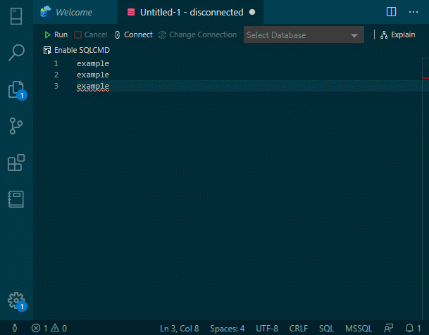

# copyAsSqlValues README
lil extension that fills the great void left by SSMS boost liscense expiration and the loss of the 'Copy as SQL values list' shortcut. Cooler coders code in (vs)code.



## Features

- Adds a command and key binding to copy a selection of lines as a list of sql formated strings 
- Also works with grid selection
- Edits the selection in place on your clipboard (allows you to paste into other editors)

## Instructions

This extension was scaffoled with yeoman code generator and built with vsce
To build from source:

```bash
# if you do not already have vsce installed
npm install -g vsce

# then execute vsce package inside the root directory of this cloned repo
cd /path/to/AdsSqlCopy/
vsce package
```
Then from vscode extension menu, select options > "install from VSIX..."

see [vsc extension quickstart](./vsc-extension-quickstart.md) for more information about vs code extension development and debugging (provided by yo code-generator)

## Release Notes

### 1.0.0

- First of SO many copyAsSqlValues extension releases

### 1.0.1

- Now filtering empty string and null! WOW! HUGE!

### 1.0.2

- The npm package y18n before versions 3.2.2, 4.0.1, and 5.0.5 is vulnerable to Prototype Pollution.
> Not sure where this dependancy comes from, we don't use yargs in our extension. Updated it to 4.0.1 to be safe, considering removing...

CVE-2020-7774
high severity
Vulnerable versions: = 4.0.0
Patched version: 4.0.1

- escapes single quotes now ' -> ''

-----------------------------------------------------------------------------------------------------------

**proving once and for all that DANK is a c-tier vscode user at best!**

